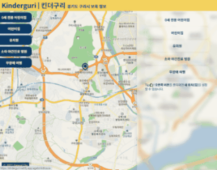

# 킨더구리 v2 | Kinderguri v2

경기도 구리시 소재 보육 관련 시설들을 검색할 수 있는 웹 어플리케이션

You can search locations related to child care, like kindergartens and daycare centers, located in Guri-si on Kakao Map.

<p align="center">
</img>
</p>

#### <a href="https://kinderguri.netlify.app/" target="_blank">**킨더구리 v2로 이동**</a>

#### <a href="https://kinderguri.herokuapp.com/" target="_blank">**킨더구리 v1로 이동**</a>

---

## Features

- 어린이집, 유치원, 0세 유아전용 어린이집, 소아 야간진료 병원, 무장애 여행지(barrier-free)
- 각 카테고리 내 유형 혹은 검색어로 필터링 검색
- 해당 장소에 관한 상세 정보 열람 (리스트의 '자세히' 클릭)
- 내 위치 설정 (오른쪽 클릭)
- 반응형 웹 페이지

---

## Development Mode

```
(server)
npm run dev
---
(client)
cd frontend
npm run dev
```

---

## Structure

    |-- frontend
        |-- src
            |-- assets
            |-- component
            |-- container
            |-- pages
            |-- util
        index.html
        index.tsx
        schema.ts
        cache.ts
        ...
    |-- src
        |-- datasource
        |-- lambda
    ...

---

## Update

- 2021.04 킨더구리 v2
  - 반응형 웹 페이지
- 2021.03 킨더구리 v2 (dev branch)

  - 컨텐츠 추가: 0세 영아 전용 어린이집, 소아 야간진료 병원, 무장애 여행지 리스트
  - GraphQL: apollo server 및 apollo client로 graphql 도입
  - UI tool: emotion, styled-components
  - geolocation으로 현재 위치 추적

- 2020.12 킨더구리 v1
  - 반응형 웹 페이지
- 2020.07 킨더구리 v1 (master branch)
  - 구리시 소재 유치원 및 어린이집 검색
